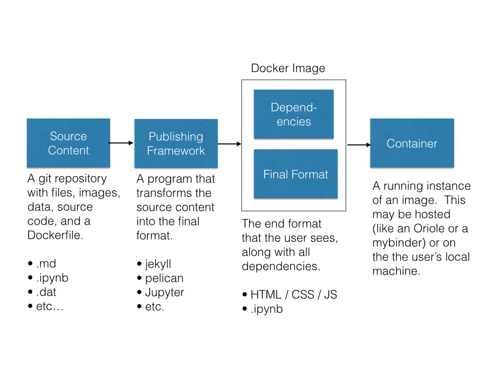
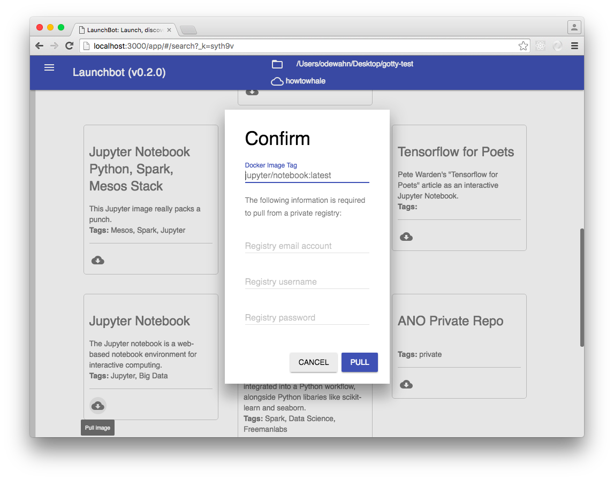
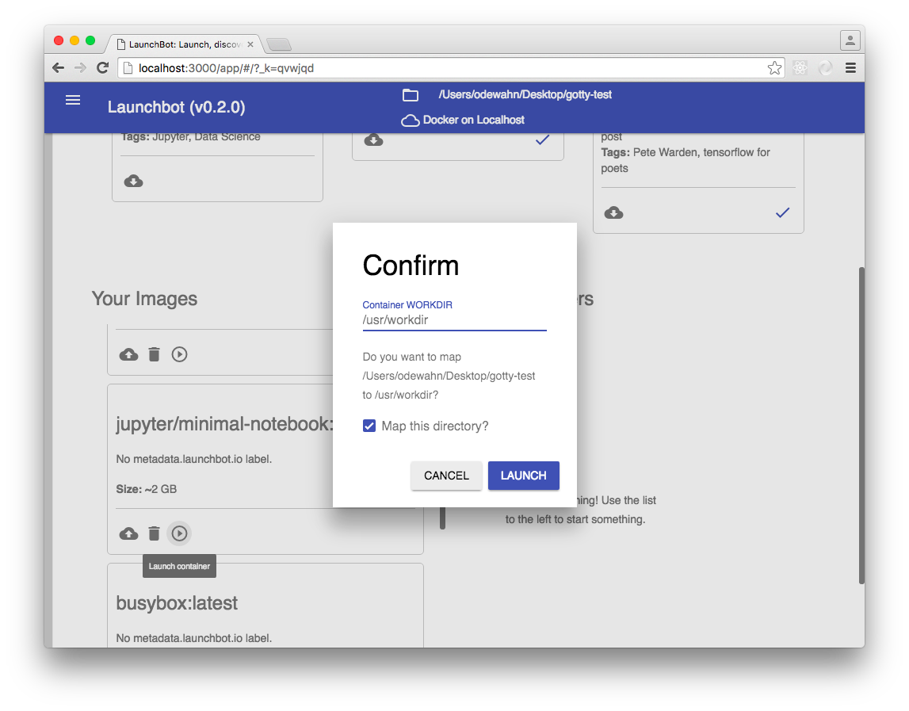
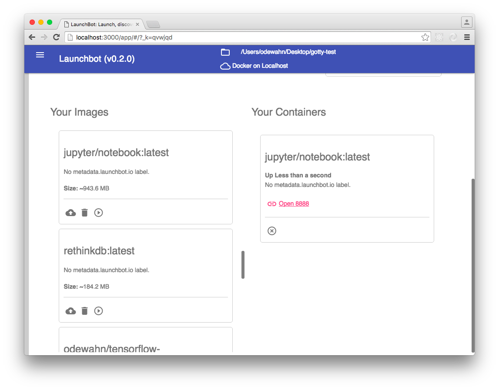
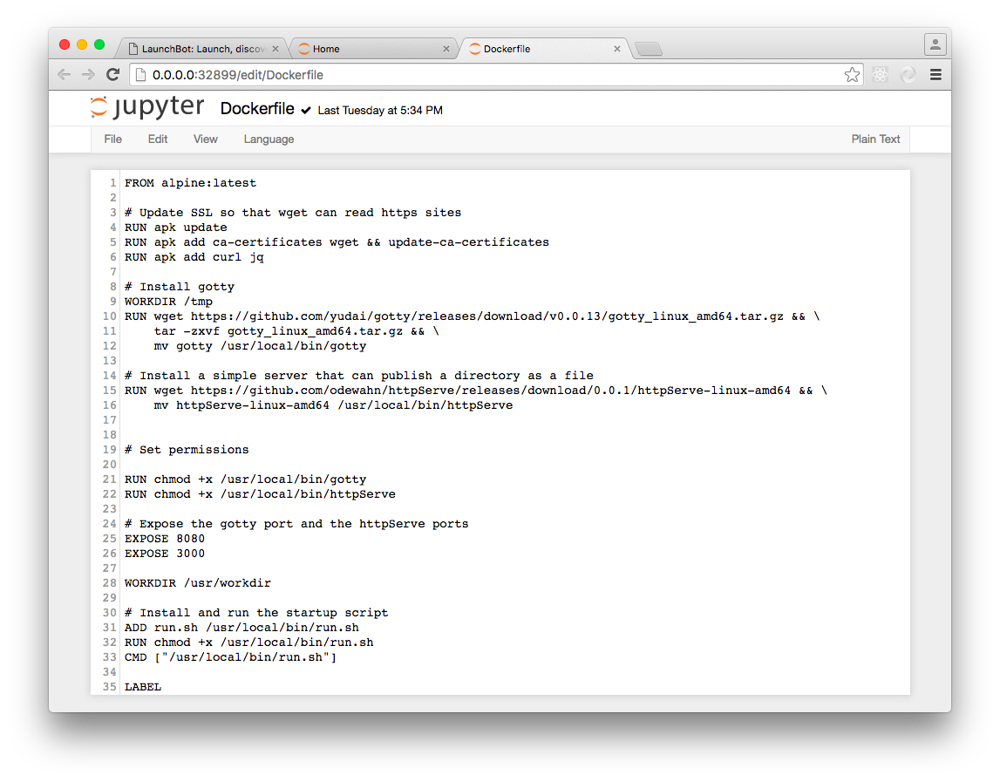
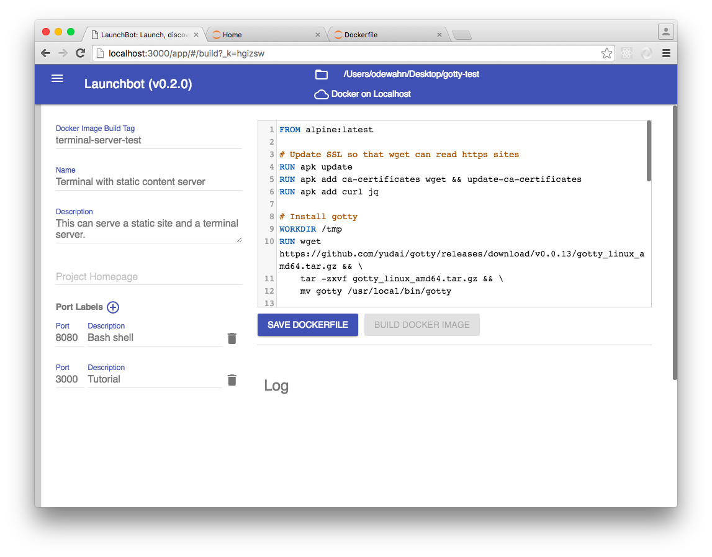

# Content Framework

This document describes a process for creating interactive content.  It begins with a general overview of out framework, and then provides a set of steps to follow.

The goal of the framework is to take your original source material and turn it into a Docker Image that a user can run.



## Content Overview

### Source Content

All the assets files that make up the project. For example, source content might be a set of markdown files, figures, code examples, and some custom css files.  All of these source assets are checked into a git repository.

### Publishing Framework

The publishing framework "transforms" source content into the final format the user sees.  A framework's power comes from the types of source content and user interactions it enables. For example, text, images and video are the basic table stakes, but a powerful framework can also deliver interactive charts that link to source data, executable code samples, complex equations and formulas, assessments, and so forth.

There are 4 basic types of frameworks: WYSIWYG, database, build-based, and bespoke.

* The *WYSIWYG* model combines the editor and the final format into one seamless environment. For example: Jupyter Notebooks, Nteract, Google Docs, etc.  The strength of the model is that it is generally simple for authors and other people in the production workflow to (as long as they have the right software installed).  The weakness is that you're limited to whatever tools that system supports.  The huge interest in the Jupyter comes from its support of a vast array of content types.
* The *build* model requires a program to transform the source content into the final format.  Typically this program runs continuously to "watch" the source files and rebuilds whenever they change.  Examples of these systems include: jekyll, pelican, gitbook, latex, as well as "literate programming" tools like godocs.
* The *database model* organizes the all the content elements into fields that are stored in a database that drives the final format.  For example: Wordpress, Codecademy.
* The *bespoke* model is a custom application in which the author basically codes the final format from scratch.

### Final format

The final format is what you want the audience to get in the end.  For example,you might want them to have a Jupyter Notebook or a Jekyll site with a data visualization plugin.  Examples include:

* A site built with Jekyll
* Jupyter Notebook
* Terminal / shell with file access
* Toree application

## Specifying the Dependencies with a Dockerfile

Once you have the content, you can add a file name `Dockerfile` to specify the required dependencies.  

A Dockerfile is  consists of simple instructions that are executed in order. For example, here's an example that installs a web-based terminal server called [gotty](https://github.com/yudai/gotty) onto the Alpine linux image:

```
FROM alpine:latest

# Update SSL so that wget can read https sites
RUN apk update
RUN apk add ca-certificates wget && update-ca-certificates
RUN apk add curl jq

# Install gotty
WORKDIR /tmp
RUN wget https://github.com/yudai/gotty/releases/download/v0.0.13/gotty_linux_amd64.tar.gz
RUN tar -zxvf gotty_linux_amd64.tar.gz
RUN mv gotty /usr/local/bin/gotty


# Expose the gotty port and the httpServe ports
EXPOSE 8080

WORKDIR /usr/workdir

# Install and run the startup script
CMD gotty -w /bin/sh
```

Here are some of the more common elements:

## `FROM`

The `FROM` keyword specifies the _base image_ used onto which you'll be layering your content and dependencies.  The base image can also have an optional, such as ":latest", that specifies a specific version. Note that the dockerfile *must* begin with the `FROM` directive.

For example, here are some typical values:

* `FROM ubuntu:latest`
* `FROM jupyter/notebook:latest`
* `FROM busybox:latest`
* `FROM node`

## `RUN`

Run will execute the given command, and can be used (among other things!) to install dependencies.  For example:

* `RUN apt-get update`
* `RUN apt-get install -y curl wget`
* `RUN pip install flask`
* `RUN wget https://example.com/datafile.txt`

## ADD

Adds files from your current repo to the image in the directory you specify:

* `ADD . /usr/data`
* `ADD nginx.conf /var/www/nginx/nginx.conf`

## `EXPOSE`

The `EXPOSE` command is used to publish services that are running on a given ports.  For example, if you are doing an express app, you would want to publish port 3000 to make it available.

* `EXPOSE 3000`
* `EXPOSE 8000`
* `EXPOSE 8888`

## `WORKDIR`

Defines the directory used when a command executes; the last WORKDIR will be used as the working directory when the container starts.

* `WORKDIR /usr/data`
* `WORKDIR /tmp`

## `CMD`

Typically the last command in the Dockerfile, `CMD` specifies the default command that executes when the container starts container.

* `CMD ipython notebook --ip=0.0.0.0 --no-browser`
* `CMD "/usr/local/bin/run.sh"`

## Container

The Container is the last step in the process.  Once you're done creating the image, you'll push it into our docker registry, and then it will either be accessible to users for them to download it (i.e., it's a public image) or available on a hosted service (like Oriole)

# Development process for Jupyter

With the overview complete, we're now ready to talk about how to work in this environment.  Since it's a very common use case, we'll focus on the workflow for Jupyter Notebooks, although the same principles will apply for other environments.

The instructions below outline the steps to follow in order to edit your Jupyter notebook.

## Before you start

This guide assumes you'll be working locally.  Here's what you'll need to do:

* Install the [Docker Engine](https://docs.docker.com/engine/installation/) for your platform.  We strongly recommend the new Docker for Mac and Docker for Windows systems, as they provide a simpler system than the old `docker-toolkit`
* Install [git](https://git-scm.com/book/en/v2/Getting-Started-Installing-Git) for your platform

Optionally, you can also install [launchbot](http://launchbot.io), a new tool that provides a GUI interface for working with Docker images.


## Create a content repo

If you don't have one already, create a `git` repository to store your content.  This can be on GitHub or on [O'Reilly Atlas](http://docs.atlas.oreilly.com/using_git.html)

## Clone your content repo to your local machine

```
git clone <git url>
```

## Pull the base image

### Commandline

```
docker pull jupyter/notebook:latest
```

### Launchbot

Use the "Search Feature" to find the image you want and then click the "Download Button."



## Change into your content dir and start a branch

* `cd` into the content directory you clone earlier
* Start a new branch for your editing session [optional]

```
git checkout -b addIntroduction
```

### Start the Notebook container

Launch the Jupyter Notebook, making sure to expose the correct ports.  In addition, map a volume from your local drive into the WORKDIR on the container so that your changes are saved on your host machine, not the container.

#### Commandline

```
docker run -p 8888 -v $(pwd):/usr/workdir jupyter/notebook
```

#### Launchbot

Click the "launch" button and select the options.  Be sure to check the "Map local volume" checkbox so that your changes will be saved to your local machine.



### Open the notebook and edit your content

Once the container is running, find the link where the Notebook is being served and open it.

#### Commandline

Since Docker maps the container port to a random open port on you host, you need to to run `docker ps` to find the link where the port is exposed.  

```
$ docker ps
CONTAINER ID        IMAGE               COMMAND             CREATED              STATUS              PORTS                                              NAMES
b180cd9ad2fa        152f8464d9ca        "/run_jupyter.sh"   About a minute ago   Up 5 seconds        0.0.0.0:32900->6006/tcp, 0.0.0.0:32899->8888/tcp   ffohfpandkli
```

In this example, the link is `0.0.0.0:32899`

#### Launchbot

Click the port you want.



### Edit your content

Once you're in the Notebook environment, you can create files, run programs that are installed on the underlying image, and so forth.

As you work, you can (and should!) periodically commit the changes in your branch and merge them to master, just as you would with a software project.

#### Create the Dockerfile and/or installation instructions

In addition to the basic notebook text, your project will probably require some addition dependencies specific to you.  For example, if you're writing a tutorial on some Python machine learning package, you'll need to make sure that package is available.  

Capturing these dependencies in a repeatable way is the key goal of including a Dockerfile with your project: it provides the list of instructions we need to build a fully reproducible environment.

Think of it as a specialized bash script that you need to run to set everything up. To install a dependency, just add a `RUN` directive in your Dockerfile.  For example:

```
RUN pip install seaborn numpy
```

#### Edit the Dockerfile with the Notebook's text editor



#### Edit the dockerfile with Launchbot



Note that you can also use Launcbot to create a Docker `LABEL` that provides metadata about the image that Launchbot uses to display better information about your project.  For example, you can enter meaningful labels for your ports, a description, and so forth.  These labels are then base64 encoded and included in the label commend.

*NB*: I'll be generalizing the label system in the next release so that you can edit them with) [json-schema](http://json-schema.org/).

#### Alternative: Create an "installation instructions" Notebook

Alternatively, if you're uncomfortable with the Dockerfile, you can just create a notebook that has the installation instructions.  You can use Jupyter's "shell magics" and the "bang" operator (which is a "!") to execute the commands in bash directly on the container.  For example, you can enter this in a code cell:

```
!pip install seaborn numpy
```

And the notebook will run the command with bash.

Note, though, that you will need to run these commands each time you start the container.  By including these commands in the Dockerfile, you're placing them directly on the underlying image.

### Add your content to the image

Use the `ADD` command in the Dockerfile to bundle your content directly onto the image.  That way, your image becomes a standalone environment that readers can access in a variety of ways.
